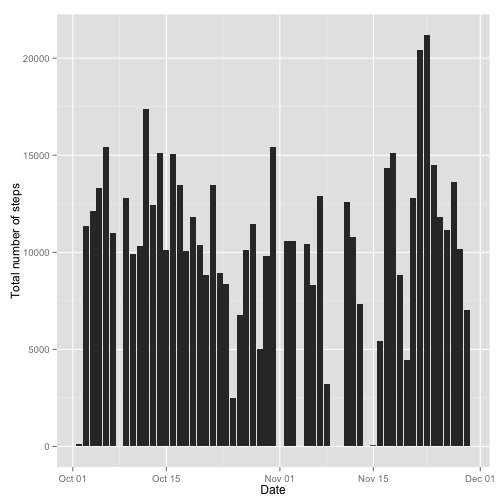
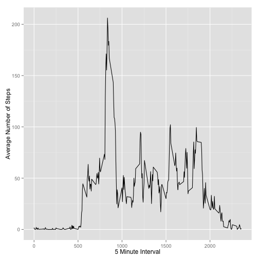
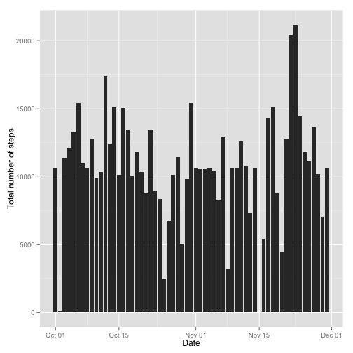

##Loading and preprocessing the data
To begin with, we need to load the needed packages:


```r
require(ggplot2)
```

Then we have to read the data from the csv file:


```r
unzip("activity.zip")
activity <- read.csv("activity.csv", stringsAsFactors = FALSE)

activity$date <- as.Date(activity$date)
```

##What is mean total number of steps taken per day?

First of all we want to aggregate the data by date:


```r
totalSteps <- aggregate(steps ~ date, data=activity, FUN=sum, na.rm=TRUE)
```

The histogram with the total number of steps per day is:


```r
ggplot(totalSteps, aes(x=date, y=steps)) + stat_summary(fun.y="sum", geom="bar") + xlab("Date") + ylab("Total number of steps") 
```

 


The mean of the total number of steps taken per day is:


```r
mean(totalSteps$steps)
```

```
## [1] 10766.19
```


The median of the total number of steps taken per day is:


```r
median(totalSteps$steps)
```

```
## [1] 10765
```


##What is the average daily activity pattern?
We aggregate the data by the mean of every individual interval:


```r
intervalSteps <- aggregate(steps ~ interval, data=activity, FUN=mean, na.rm=TRUE)
```

We make a time series plot of the 5-minute interval and the average number of steps taken, averaged across all days:


```r
ggplot(intervalSteps, aes(interval, steps)) + geom_line() + xlab("5 Minute Interval") + ylab("Average Number of Steps")
```

 


The 5-minute interval that, on average across all the days in the dataset, contains the maximum number of steps is:


```r
intervalSteps[which.max(intervalSteps$steps),]
```

```
##     interval    steps
## 104      835 206.1698
```

##Imputing missing values

We calculate the total number of missing values in the dataset:


```r
sum(!complete.cases(activity))
```

```
## [1] 2304
```

To fill the missing value from the original dataset, we decide to use the interval mean previously calculated.
First, we merge the original dataset with the mean dataset:


```r
filledData <- merge(activity, intervalSteps, by='interval')
colnames(filledData) <- c("interval", "steps", "date", "mean")
```

Then we replace the missing values with the interval mean (rounded to the nearest integer):

```r
filledData$mean <- as.integer(filledData$mean)
filledData$steps <- ifelse(is.na(filledData$steps), filledData$mean, filledData$steps)
filledData$mean <- NULL
```

To make a histogram of the dataset without missing values, we have to aggregate the data by day:


```r
filledDataByDay <- aggregate(steps ~ date, data=filledData, FUN=sum)
```

This is the histogram with the new dataset:


```r
ggplot(filledDataByDay, aes(x=date, y=steps)) + stat_summary(fun.y="sum", geom="bar") + xlab("Date") + ylab("Total number of steps")
```

 

As we've done previously, the mean of the new dataset is:


```r
mean(filledDataByDay$steps)
```

```
## [1] 10749.77
```

And the median is:

```r
median(filledDataByDay$steps)
```

```
## [1] 10641
```

The mean and the median are not very different from what we calculated before.

##Are there differences in activity patterns between weekdays and weekends?

First we create a factor variable to describe the type of day:

```r
dayType <- function(date) {
            if (weekdays(as.Date(date)) %in% c("Saturday", "Sunday")) {
                "weekend"
            } else {
                "weekday"
            }
        }
```

Then we apply this function to the filled dataset:

```r
filledData$dayType <- as.factor(sapply(filledData$date, dayType))
```

Finally we make a plot to compare the difference in the average number of steps between weekdays and weekends:


```r
par(mfrow = c(2, 1))
for (type in c("weekend", "weekday")) {
    daytype <- aggregate(steps ~ interval, data = filledData, subset = filledData$dayType == type, FUN = mean)
    plot(daytype, type = "l", main = type)
}
```

 
